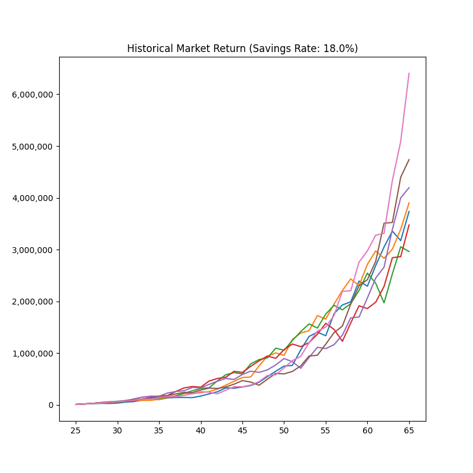

These scripts show how to implement the spreadsheet desribed here:

https://loufranco.com/blog/very-simple-net-worth-estimator

I use pyenv and pip to install python, so these instructions require that.

Use at least Python 3.9.4:

```bash
pyenv install 3.9.4
```

Here's what I did to install matplotlib

```bash
python -m pip install -U cython
python -m pip install -U numpy
python -m pip install -U matplotlib
```

There's a requirements.txt if you want to use that:

```base
python -m pip install -r requirements.txt
```

The data in mkt-data.tsv is from: [http://pages.stern.nyu.edu/~adamodar/New_Home_Page/datafile/histretSP.html](http://pages.stern.nyu.edu/~adamodar/New_Home_Page/datafile/histretSP.html)

## Usage

**nw-market.py**: A command-line utility that will show a savings scenario against historical market data from 1928, 1933, 1938 ... 1958 so you can see a range of real outcomes.

```
$ python nw-market.py
Usage: python nw-market.py <chart output file> <ending age> <savings rate>
Example: python nw-market.py market.png 65 0.18

$ python nw-market.py market.png 65 0.18
$ open market.png
```



**nw-savings.py**: A command-line utility that will show the expected net worth over time
using two savings rates and a flat 6% market return.

```
$ python nw-savings.py
Usage: python nw-savings.py <chart output file> <savings rate 1> <savings rate 2>
Example: python nw-savings.py savings.png 0.18 0.12

$ python nw-savings.py savings.png 0.18 0.12
$ open savings.png
```


## Contributers

- [Lou Franco](https://github.com/loufranco)
